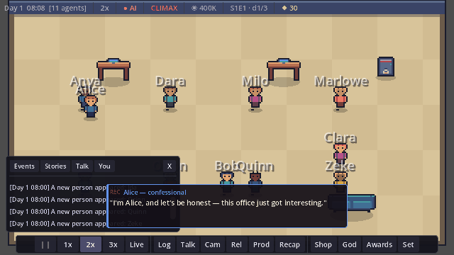
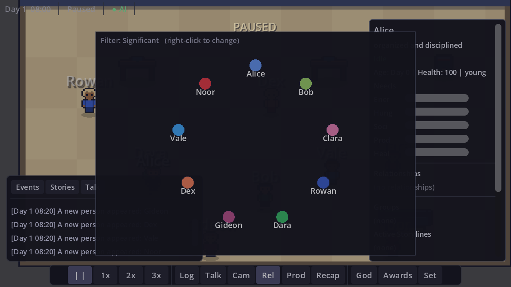
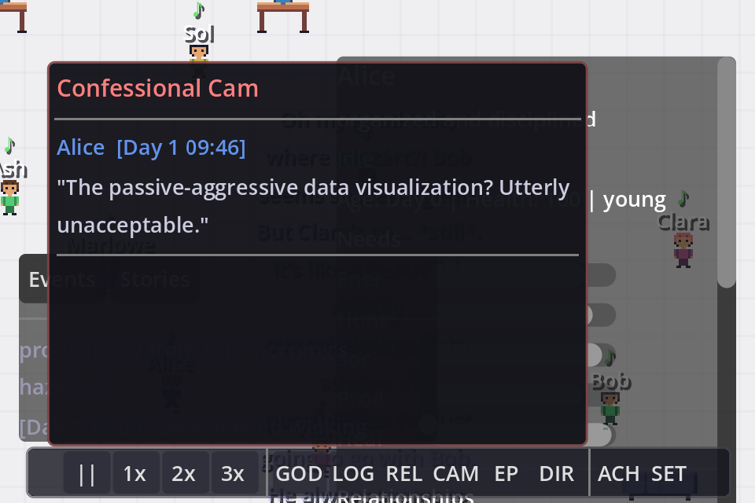

# Aphae

[](https://github.com/rsanandres/aphae/actions/workflows/ci.yml)
[](https://github.com/rsanandres/aphae/releases/latest)
[](https://godotengine.org)



**A tiny reality show that lives on your desktop.** AI-driven agents with distinct personalities share an office, and the cameras never stop rolling. Leave it running in the corner of your screen while you work — the office keeps living without you, and tells you what you missed when you glance back.

You're the producer, not the player-character: you rearrange the set, nudge the cast, plant a rumour, and decide what airs. The drama writes itself.

Built with **Godot 4.6** (GDScript). Fully playable offline — no accounts, no services, no assets; even the sprites and audio are generated at runtime.

## Play it

**[⬇ Download the latest release](https://github.com/rsanandres/aphae/releases/latest)** — Windows and Linux. Unzip and run, nothing to install.

**[▶ Play in your browser](https://rsanandres.github.io/aphae/)** *(going live soon)* — the full simulation, no download.

Out of the box the cast runs on a rich personality-driven heuristic brain. If you have [Ollama](https://ollama.ai) running, they get an LLM brain instead — live-written dialogue, confessionals, and inner thoughts in each character's own voice. See [LLM setup](#llm-setup-optional).


*Drama strikes, and an agent cuts away to the confessional booth. Every line is generated live from that character's personality and memories — nothing here is scripted.*

| | |
|:--:|:--:|
|  |  |
| Agents living their own lives | Producer panel — nudge, interview, plant a rumour |
|  |  |
| The relationship web, live | The season's confessional history |

---

## The cast

- **AI-powered agents** — each has a procedurally generated personality (Big Five traits), appearance, and backstory. An LLM (or the heuristic brain) drives their decisions, conversations, and memories.
- **Emergent relationships** — friendships, rivalries, crushes, and social groups form organically from personality compatibility and shared experience. Romance grows out of good conversations; confessions get accepted or shot down.
- **Deep memory** — agents remember conversations, events, and what they said on camera, and it all feeds back into how they behave. Scored retrieval, emotional metadata, narrative threads.
- **Goals that resolve** — every agent arrives wanting something. Goals accrue real progress from what actually happens — a new face at the water cooler, a night at the desk, a confession that lands — against a deadline. Landing one bends the personality that earned it; a near miss buys one last push; a resolved want makes room for a new one.
- **A full life** — agents age through life stages, get sick, grieve, and die. New hires arrive with first impressions; the poached and the departed sometimes walk back in with their memories and grudges intact.

## The drama

- **Drama Director** — a RimWorld-style storyteller paces 37 data-driven life events (arguments, promotions, secret admirers, crises) for narrative satisfaction, plus multi-day personal arcs that unfold in stages. Events leave lasting marks: grudges, avoidance, permanently bent traits.
- **Confessional Cam** — when drama strikes, an involved agent cuts to the booth and reacts in first person. A host narrator stitches the season together. Press **C** for the full history.
- **Secrets & lies** — some of the cast arrive hiding something. On the floor they deflect and deny; in the booth, sooner or later, they admit it — to you, and only you. A secret spreads the only way secrets do: someone trusts someone enough to tell them, and that someone talks. Enough ears and it stops being a secret, publicly and painfully.
- **The Mole** — sometimes the host leans in: *someone in this office is not who they say they are.* One cast member is quietly wrecking things, and the only evidence is what people saw, heard secondhand, or admitted on camera. Call a **house meeting** and the cast votes from what *they* believe — not what you know. Vote out the mole and it's ratings gold; frame an innocent and the office turns meaner while the real one gets bolder; wait too long and they walk out grinning.

## You, the producer

- **Producer panel** (**P**) — *nudge* an agent (they can refuse — it's a suggestion, not a command), *interview* them in their own voice, *plant a rumour* true or false, or crown a **star of the episode** — the camera follows them and the spotlight literally buys them the better brain.
- **Seasons & Influence** — every three days wraps an episode with a ratings grade and an Influence payout. Spend it in the **Catalog** (**B**): objects with social physics (karaoke duets, grudge-dissolving meditation pods), interventions, studio upgrades. Unlocks persist across sandboxes.
- **Producer dilemmas** — occasionally the show pauses and hands you the call: leak a secret or bury it, counter-offer your poached star or film the walkout. The clock decides if you don't.
- **"Because of you"** — everything you do lands in the **You** tab of the log, with what rippled from it. Control you can't see the effect of doesn't feel like control.
- **Episode Recap** (**E**) — a shareable writeup of the season: top storylines, the mole verdict, dreams kept and broken, secrets out, the best confessional quotes, the full cast. Exports to Markdown.
- **God Mode** (**Tab**) — rearrange the set, place objects, spawn and remove cast.

## The machine

- **Ambient by design** — the office doesn't pause when you click away; it drops to low power and keeps living, then hands you a "While You Were Away" digest. Desktop-pet mode shrinks it to a borderless always-on-top corner of your screen.
- **39 achievements**, 5 save slots with backups and corruption recovery, auto-save.
- **Procedural everything** — sprites, audio, and personalities are generated at runtime. No art or sound assets in the repo.

## Controls

| Key | Action |
|-----|--------|
| **Space** | Pause / Unpause |
| **1 / 2 / 3** | Speed 1x / 2x / 3x |
| **Tab** | God Mode |
| **L** | Narrative Log (Events / Stories / Talk / **You**) |
| **R** | Relationship web |
| **C** | Confessional Cam |
| **E** | Episode Recap |
| **P** | Producer panel |
| **B** | Producer's Catalog |
| **X** | Cut to the drama |
| **F5 / F9** | Quick save / load |
| **F12** | Screenshot |
| **Esc** | Close overlays |
| **Scroll / middle-drag** | Zoom / pan |
| **Click an agent** | Follow and inspect |

Right-click anywhere for the context menu.

## Running from source

Requires [Godot 4.6](https://godotengine.org/download).

```bash
git clone https://github.com/rsanandres/aphae.git
cd aphae
godot --editor project.godot   # or: godot --path .
```

### LLM setup (optional)

The game is complete without an LLM — the heuristic brain has hundreds of personality-flavored lines. For live-written dialogue, install [Ollama](https://ollama.ai) and pull a model:

```bash
ollama pull smollm2:1.7b
```

Then set the backend in **Settings → LLM** from the main menu (Ollama is auto-detected at `localhost:11434`).

## Development

- **Tests**: eight headless harnesses, 300+ assertions, plus windowed layout/interaction sweeps. One command runs everything the way CI does:

  ```bash
  GODOT=/path/to/godot bash tools/run_tests.sh
  ```

- **CI** runs the full suite on every push and PR; harnesses are discovered from disk, a script error fails even a passing run, and failures publish their output to the job summary.
- **Releases**: pushing a `v*` tag exports, smoke-tests, and publishes Windows + Linux builds as a GitHub Release. Pushes to `main` also build the web version for GitHub Pages.
- **[PLAN.md](PLAN.md)** is the living design doc and devlog — decisions, playtest findings, and the traps that cost real time. If you're poking at the code, start there.

### Architecture

26 autoload singletons decoupled through a global **EventBus** (~60 signals): time, agents, LLM backends, conversations, the drama/event/arc directors, goals, secrets, the mole case, the narrator and confessional layers, the producer economy, and the impact log.

```
Think tick (tiered by attention)
    → Brain (LLM, else heuristic)
        → Decision (pursue a goal / use object / talk / wander)
            → State machine (IDLE → DECIDING → WALKING → INTERACTING/TALKING)
                → Needs decay · memory formation · relationships · goal progress
```

| Directory | Contents |
|-----------|----------|
| `autoloads/` | The 26 singletons + LLM backend modules |
| `scenes/agents/` | Agent scene: needs, brains, memory, relationships, health |
| `scenes/objects/` | InteractableObject base + the office object types |
| `scenes/conversations/` | Multi-turn dialogue, the rumour mill hook |
| `scenes/events/` | Event manager, arcs, the consequence engine, the mole director's scripts |
| `scenes/main/` | Game root + the test harnesses |
| `scenes/ui/` | HUD, panels, menus, toasts |
| `scripts/data/` | MemoryEntry, PersonalityProfile, GoalState, SecretState, CaseState… |
| `scripts/utils/` | Sprite/audio/personality generators, PromptBuilder, RumorMill, EpisodeRecap |
| `resources/` | Personalities, prompts, events, arcs, achievements, the catalog (all data files) |

## License

All rights reserved. A personal project by [@rsanandres](https://github.com/rsanandres).
