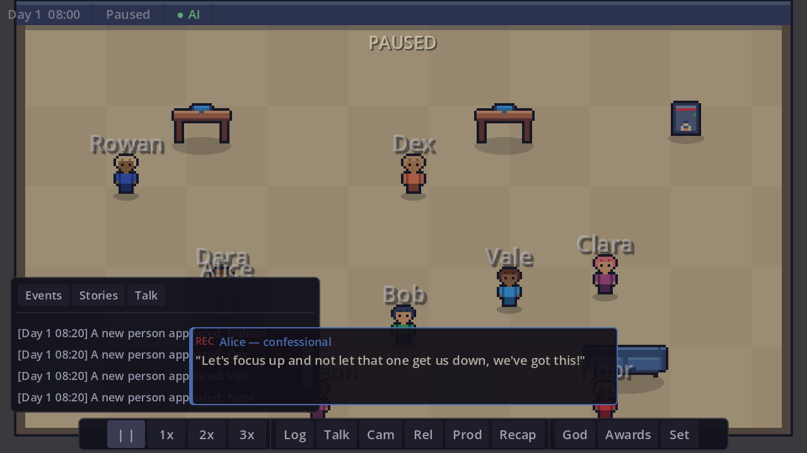
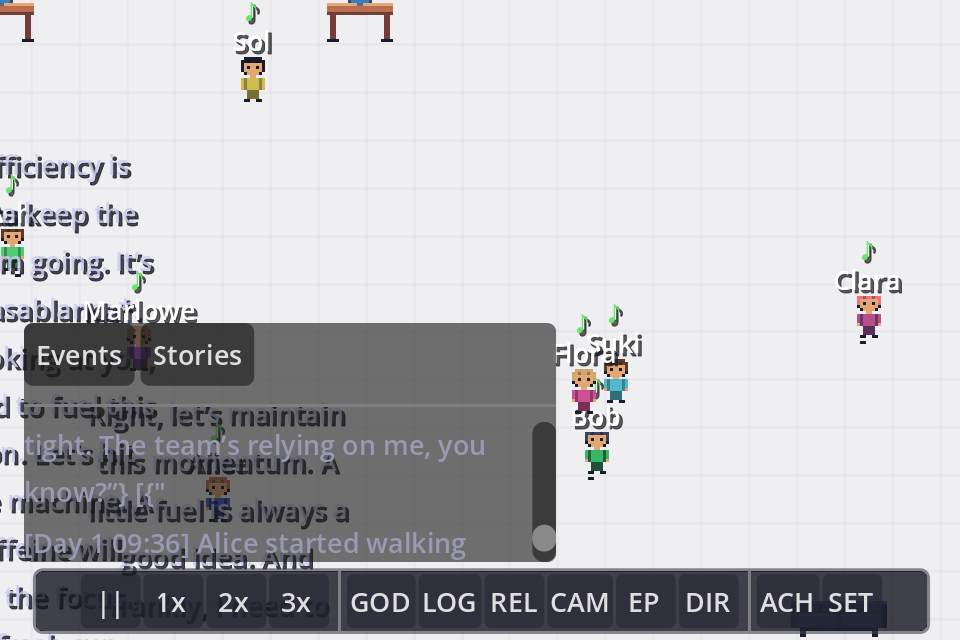
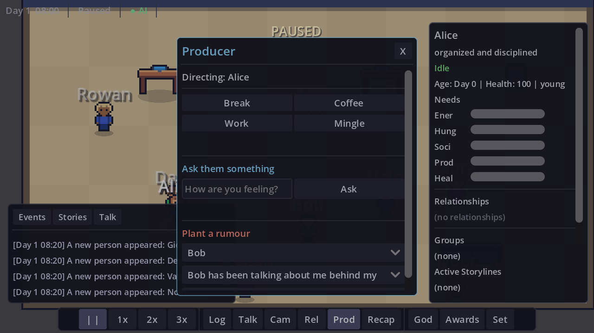

# Aphae

**A tiny reality show that lives on your desktop.** AI-driven agents with distinct personalities share an office, and the cameras never stop rolling. Leave it running in the corner of your screen while you work — the office keeps living without you, and tells you what you missed when you glance back.

You're the producer, not the player-character: you rearrange the set, nudge the cast, plant a rumour, and decide what airs. The drama writes itself.

Built with **Godot 4.6** (GDScript). Bundled LLM for offline AI decisions.

 



*Drama strikes, and an agent cuts away to the confessional booth. Every line is generated live
from that character's personality and memories — nothing here is scripted.*

| | |
|:--:|:--:|
|  |  |
| Agents living their own lives | Producer panel — nudge, interview, plant a rumour |

---

## Features

- **AI-Powered Agents** — Each agent has a unique procedurally generated personality (Big Five traits), appearance, and backstory. An LLM drives their decisions, conversations, and memories. A rich heuristic fallback ensures the game works without any LLM at all.
- **Emergent Relationships** — Agents form friendships, rivalries, romantic interests, and social groups organically based on personality compatibility and shared experiences.
- **Deep Memory** — Agents remember past conversations, events, and relationships. Memories influence future decisions and dialogue.
- **Life Simulation** — Agents age through life stages (young → adult → senior → dying), develop health conditions, and eventually die. Other agents grieve based on relationship closeness.
- **Drama Director** — A RimWorld-inspired storyteller paces random life events (arguments, promotions, secret admirers, office crises) for narrative satisfaction.
- **Conversations** — Multi-turn dialogues driven by LLM or heuristic fallback, flavored by personality traits, recent memories, and emotional state.
- **Confessional Cam** — Reality-TV style talking heads. When drama strikes, an involved agent cuts away to the confessional booth and reacts in first person, in their own voice. A host narrator delivers day recaps as tension builds. Agents *remember* what they said on camera, so a confession or a bit of trash talk colors how they behave afterward. Press **C** for the full confessional history.
- **Episode Recap** — Press **E** for a shareable Markdown writeup of your run: the top storylines, the best confessional quotes, and the full cast. Export it to a file, or read it on the game-over screen when the office finally falls silent.
- **Events With Consequences** — 37 data-driven life events that leave lasting marks: arguments breed grudges and avoidance, sabotage plants hidden-actor mysteries, big moments permanently bend personalities a little. Multi-day personal arcs (burnout spirals, secret hobbies, goal pursuits) unfold in stages.
- **Secrets & Lies** — Some of the cast arrive hiding something, and the show is built around the gap between what they say and what's true. On the floor they deflect and deny; in the confessional booth, sooner or later, they admit it — to you, and only you. A secret spreads the only way secrets do: someone trusts someone enough to tell them, and that someone talks. Once enough people know, it stops being a secret, publicly and painfully. You'll know more than the cast does. That's the show.
- **Goals That Resolve** — Every agent arrives wanting something, and the office is where they find out whether they get it. Goals accrue real progress from what actually happens — a new face at the water cooler, a night finishing work at the desk, a confession that lands, a day that ends with everything in balance — and they carry a deadline. Come up short and they quietly let it go; come *close* and they buy themselves one last push. Landing one bends the personality that earned it and sends them straight to the confessional booth. Open an agent (click them) to see what they're chasing and how far along they are.
- **A Cast That Breathes** — Organic romance (crushes grow out of good conversations), new hires with first impressions, poaching offers, and departed agents who sometimes walk back in — with their memories and grudges intact.
- **Ambient by Design** — The office doesn't pause when you click away. It drops to a low-power posture (heuristic brains, stretched think cadence, muted audio) and keeps living; when you come back, a "While You Were Away" digest catches you up on the drama you missed. Shrink it to desktop-pet mode and it lives in a corner of your screen all day.
- **Seasons & Influence** — Every three days wraps an episode with a ratings score and an Influence payout. Spend it in the Producer's Catalog (**B**): unlockable objects with social physics (karaoke duets, grudge-dissolving meditation pods), interventions (anonymous gifts, leaked memos, documentary crew days), and studio upgrades. Unlocks persist across sandboxes.
- **Producer Dilemmas** — Occasionally the show pauses and hands YOU the call: leak a cast member's secret or bury it, counter-offer your poached star or film the walkout. The default happens if you let the clock run.
- **Producer Controls** — Press **P** to stop being a spectator. *Nudge* an agent toward something — and watch them refuse if they're disagreeable or busy, because a nudge is a suggestion, not a command. *Interview* them and get an answer in their own voice, drawn from what they actually remember. Or *plant a rumour*, true or not, and let it colour how they treat someone.
- **God Mode** — Place and remove objects, spawn/remove agents, and reshape the office environment.
- **Desktop Pet Mode** — Shrink the window to a transparent, borderless, always-on-top overlay with 3 agents living on your desktop.
- **36 Achievements** — Discovery, relationship, community, goal, secret, and milestone achievements to track your sandbox's progress.
- **Save System** — 5 save slots with automatic backups and corruption recovery. Auto-saves every 5 game-days.
- **Procedural Everything** — Sprites, audio, and personalities are all generated at runtime. No external art or sound assets required.

## Getting Started

### Requirements

- [Godot 4.6](https://godotengine.org/download) or later

### Run from Editor

```bash
# Clone the repo
git clone https://github.com/rsanandres/aphae.git
cd aphae

# Open in Godot
godot --editor project.godot
```

Press **F5** or click Play to launch.

### Run from CLI

```bash
godot --path /path/to/aphae
```

### LLM Setup (Optional)

The game works fully without any LLM — agents use a personality-driven heuristic brain with 200+ diverse dialogue lines.

For LLM-enhanced gameplay, install [Ollama](https://ollama.ai) and pull a model:

```bash
ollama pull smollm2:1.7b
```

Configure the Ollama endpoint in **Settings > LLM** from the main menu. The game auto-detects Ollama at `localhost:11434`.

## Controls

| Key | Action |
|-----|--------|
| **Space** | Pause / Unpause |
| **1 / 2 / 3** | Speed 1x / 2x / 3x |
| **Tab** | Toggle God Mode |
| **L** | Narrative Log |
| **R** | Relationships |
| **C** | Confessional Cam |
| **E** | Episode Recap |
| **P** | Producer panel |
| **B** | Producer's Catalog |
| **X** | Cut to the drama |
| **F5** | Quick Save |
| **F9** | Quick Load |
| **F12** | Screenshot |
| **Esc** | Close overlays |
| **Scroll** | Zoom in/out |
| **Middle-click drag** | Pan camera |
| **Click agent** | Follow / inspect |

Right-click anywhere for the context menu.

## Architecture

19 autoload singletons orchestrated through a global **EventBus** (~40 signals):

```
EventBus ← TimeManager ← Config ← SettingsManager
    ↓
AgentManager → LLMManager → GameManager → ConversationManager
    ↓
DramaDirector → EventManager → SaveManager → GroupManager
    ↓
Narrator → ConfessionalDirector → PlayerDirector → AudioManager → AchievementManager → TutorialManager → SteamManager
```

### Agent Pipeline

```
Think Tick (5s round-robin)
    → Brain (LLM or Heuristic)
        → Decision (idle / use object / talk to agent)
            → State Machine (IDLE → DECIDING → WALKING → INTERACTING/TALKING)
                → Needs decay, memory formation, relationship updates
```

### Key Directories

| Directory | Contents |
|-----------|----------|
| `autoloads/` | 19 singleton scripts + LLM backend modules |
| `scenes/agents/` | Agent scene, needs, brain, memory, relationships, health |
| `scenes/objects/` | InteractableObject base + 9 office object types |
| `scenes/conversations/` | Multi-turn LLM/heuristic dialogue system |
| `scenes/events/` | Drama Director + random life event definitions |
| `scenes/world/` | Office layout, navigation, day/night tinting |
| `scenes/ui/` | HUD, menus, settings, save picker, achievements, toasts |
| `scripts/enums/` | AgentState, NeedType, ActionType, LifeStage |
| `scripts/data/` | MemoryEntry, PersonalityProfile, RelationshipEntry, HealthState |
| `scripts/utils/` | SpriteFactory, Palette, PromptBuilder, AudioGenerator |
| `resources/` | Personality JSONs, prompt templates, event/achievement definitions |

## License

All rights reserved. This is a personal project by [@rsanandres](https://github.com/rsanandres).
